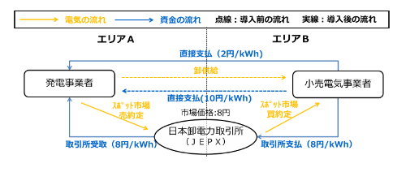

- 松平 定之, 니시무라 아사히 법률사무소 변호사
- 전기사업법과 상품선물거래법에 흔들리는 전력거래의 법적 측면을 변호사가 해설

### 이슈

- 전력거래는 전력사업에 필수적이다. 일본의 전기사업자의 리스크 관리 관점에서도 거래환경 정비 필수적.
- 일본 도매 전력거래소(JEPX) 현물시장/시간전시장 뿐 아니라 향후 선물거래/선도거래의 확대가 기대됨
- 다만, 거래형태의 다양화는 전기사업법을 포함한 법률 및 제도 정리가 필요

### Q1. 선물거래의 필요성

#### 현행 전력거래형태(일본)

    1. 현물시장(Spot Market) 
    - 거래장소 : 일본 도매 전력거래소(JEPX)
    - 거래대상 : 다음날에 전달하는 30분 단위의 전력

    2. 시간전시장(Intraday Market) : 당일 예기치 못한 수요변동, 공급변동 대응
    - 거래장소 : 일본 도매 전력거래소(JEPX)
    - 거래대상 : 당일 1시간 전 전력

----

#### 선도거래와 선물거래의 필요성

- 현물시장과 시간전시장은 가격 변동이 커서 전력조달의무가 있는 소매전기사업자에게 리스크로 작용
- *선도거래*,*선물거래*를 활용하여 미래 조달비용을 고정하고 싶은 니즈가 있음
- 연료비 조정제도를 사용하지 않는 새로운 요금체계 도입 가능

----

#### 전력선물거래를 위한 법률 개정

- 전력 자체를 거래 당사자가 전달하는 '현물거래' 기반
- 파생상품인 전력 선물시장 창설을 위해서는 **"상품선물거래법"** 개정이 필요
- 2016년 4월 전력 소매 전면자유화에 따라 **전기사업법 개정 및 상품선물거래법 일부개정**이 이루어졌고, 동법의 적용 대상이 되는 '제품'으로 **전력**이 추가됨 (상품선물거래법 2조1항4호)

----

#### 선물거래는 아직 아직 상장되지 않았음

- 위 개정에 의해 법적으로는 전력선물이 상품거래소에 상장 가능
- 2016년 여름 도쿄상품거래소(TOCOM)에서 전력선물거래 실증 시험이 이루어짐
- 상장되지 않은 이유
    1. 선물거래 이전에 현물거래량이 충분하지 않음
    2. 시스템 개발비용 부담

### Q2. 파생상품거래란?

#### 파생상품에 대한 일반적인 용어정리

- 파생상품(derivative)는 주식, 채권, 금리, 환율, 상품 등의 전통적인 거래에서 파생된 거래 상품

종류 | 설명 | 활용가치
:-------------: | ----------- | -----------
1. 선물거래    | 특정 미래시점에서의 기초자산의 가격을 정해두고,   해당 시점이 되면 정해진 조건으로 매매 | 가격 변동 회피
2. 스왑       | 미래에 발생하는 현금흐름(이자 등)을 거래 당사자간에 교환하는 것 | 미래 시장환경 리스크 헤지(역주)
3. 옵션거래    | 선물거래 및 스왑 거래에 조건을 붙이는 구조 | 선물거래와 스왑의 리스크를 헤지 (역주)

- 선물거래는 미리 거래기간을 정해두고 최종 거래일까지 자유롭게 재판매/환매 가능
- 한편, 선도거래는 원칙적으로 실제 현물의 전달을 전제로하므로 파생상품거래와는 구별됨

----

#### 규제의 필요성

- 거래소 상장여부에 따라 '상장파생상품', '장외파생상품'으로 구별됨
- 기초자산이 금융자산인 경우 "금융상품거래법", 상품인 경우 "상품선물거래법"이 적용
- 미래시장에서의 제품가격 변동으로 수익이 결정되기 때문에 적법한 절차를 거치지 않을 경우 도박행위 처벌 대상이 된다

### Q3. '상품선물거래법', '전기사업법' 이외에 전력파생상품에 대한 규제는?

#### 연계선 이용에 따른 간접경매

- 연계선 이용규칙에 따라 **'선착순 우선'** 대신 **'간접 경매 방식'**을 사용 중
- 연계선을 이용하여 전력을 거래하는 사업자는 JEPX 현물시장에서 거래를 성립해야
- (논란은 있으나) 연계선을 사이에 둔 전력거래 시 **차액결제 합의**가 장외파생상품 거래에 해당할 수 있음

#### 장외 파생상품 거래

----

- 장외파생상품 거래유형 중 하나가 약정가격과 실제 거래가격의 차액이 발생한 경우에 지급하는 금전거래, 또는 이와 유사한 거래
- 장외파생상품을 거래하기 위해서는 '상품선물거래법' 허가가 필요하며 기타 규제 대상이 됨
- 회계 상으로도 '파생상품거래'로 관리해야함
- 파생상품거래로 판단되지 않으려면, 계약조건을 '차액결제'가 아닌 **'연계선을 통한 전력의 실물거래의 부수적합의'**로 설정해야
- 또한, 판매자와 구매자가 각각의 영역에서 실제로 확실하게 거래되는 가격에 판매입찰 및 구매입찰 할 것을 합의사항으로 두는 것이 필요

### Q4. 전력선물거래는 파생상품거래에 있어서 도쿄상품거래소(TOCOM)에 상장한다는 것이지만, 선도거래는 이미 일본도매전력거래소(JEPX)에 이뤄지고 있음. 두 거래소의 관계는?

- 상품선물거래법 6조 '거래소 집중 방식'에 따라 두 시장은 "동료시장"으로 간주
- 이후 통합 여부는 논의가 필요함

