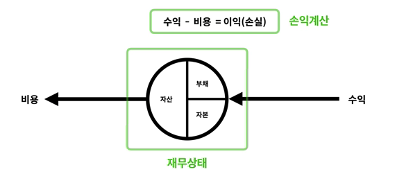

## 회계야학을 시작하며

### 연구적인 목적에서

내 연구분야는 전력, 에너지와 관련한 기업의 비즈니스모델과 현금흐름 및 의사결정과정을 다룬다. 국내외의 동료 연구자들은 해당 비즈니스모델의 타당성을 검토하기 위해 현가화(Net Present Value, NPV)를 즐겨 사용한다. 그러나 단일사업 BM만으로는 파생되는 부가가치나 금융적 해결방법 등 현실적인 기업운영을 고려할 수 없다. 결국 실제 회사의 운영을 알 필요가 있고 다시말해 **회계**를 알아야한다.

### 개인적인 이유에서

기술만 알아서는 기업을 운영할 수 없으며, 기업의 안정적인 성장 역시 기대할 수 없다. 잘 알다시피 

## Day 1

### 1. 자산 = 부채 + 자본

#### 정의

- 자산 = 경제적인 가치가 있는 재화 (돈, 부동산, 주식 등)
- 부채 = 빌린 자산  
&nbsp;

#### 자산의 형태

- 돈
- 돈으로 바꿀 수 있는 것
- 돈을 벌 수 있는 것  
&nbsp;

#### 재무상태표(대차대조표)

- 경제적인 상태를 보여주는 정보  

### 2. 수익과 비용

- 수익 - 비용 = 이익 or 손실
- 손익계산 = 어느 기간 동안 발생한 이익(or 손실)을 계산하는 것

  

### 3. 손익계산

- 매출 = 회사의 가장 본질적인 사업행위을 통해 얻게된 수익
- 매출원가 = 매출을 일으키기기 위해 소비하는 금액 (인건비, 원료비 등)
- 매출총이익 = 매출 - 매출원가   

----

- 판매비와 관리비(판관비) = 매출에 부가적으로 소요되는 비용(마케팅, 접대 등)
- 영업이익 = 매출총이익 - 판관비  

----

- 기타수익 = 회사의 부가적인 사업행위를 통해 얻게된 수익
- 기타비용 = 회사의 부가적인 사업행위에 대한 비용
- 금융수익 = 회사의 금융자산에 의한 수익
- 금융비용 = 회사의 금융자산에 대한 비용  

----

- 법인세비용차감전순이익(손실) = 영업이익 + (기타수익 - 기타비용) + (금융수익 - 금융비용)
- 법인세비용 = 법인세비용차감전순이익(손실) * 법인세비율
- 당기순이익(손실) = 법인세비용차감전순이익(손실) - 법인세비용  

